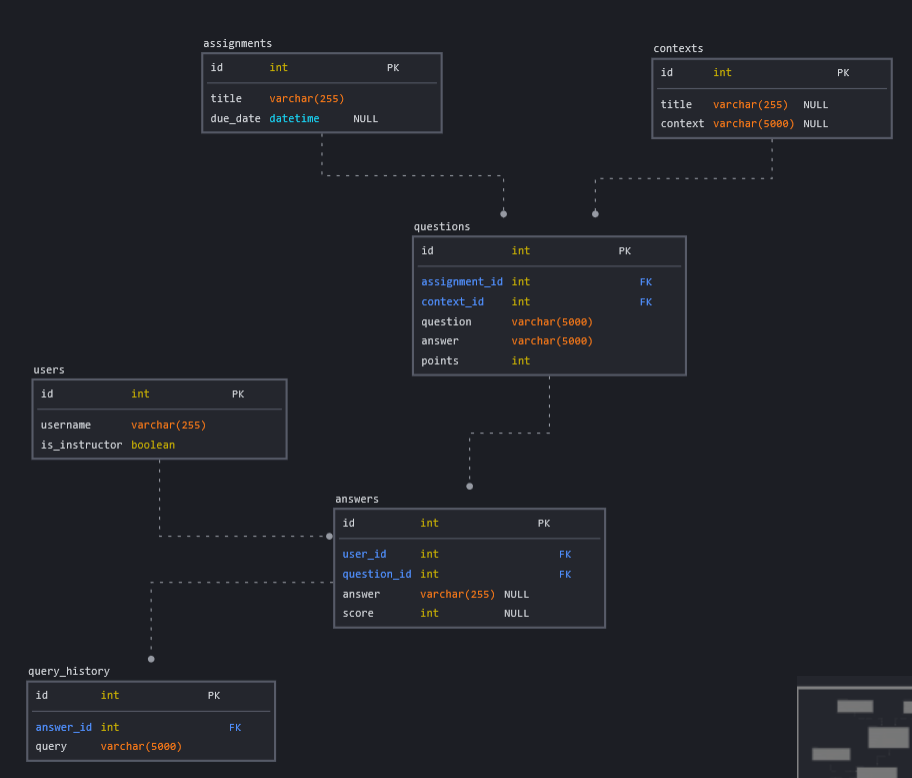

# Database

This document describes the structure of the project's database, and how to configure the project to use the database.

## Structure


The database is organized into six tables:

### users
This table stores information about individual users.

As of the time of writing, it isn't used for very much. In the future however, it could be expanded to include data to determine a user's ID number when they sign in.

### assignments
This table stores data about specific assignments, including their title and due date.

Additional data, such as the total number of questions, or total number of points, may be gathered by joining this table with related tables, such as in the following query:
```sql
SELECT
        a.id, a.title, a.due_date,
        COUNT(q.id) 'questions',
        COALESCE(SUM(q.points), 0) 'points'
    FROM assignments a
        LEFT JOIN questions q ON q.assignment_id = a.id
    GROUP BY a.id, a.title, a.due_date;
```

### questions
This table stores data for individual questions.

The `assignment_id` column describes which assignment the question belongs to.

The `context_id` column denotes which context should be used when evaluating expected and actual results.

The `answer` column contains a query which, if executed after the context query, will produce the correct results. This should **NOT** be sent to the frontend, otherwise it would be possible for a student to view the answer.

### contexts
This table contains context queries that are used to evaluate a question's expected and actual results.

For example, a question may ask the student to select all columns from a table called "Employees." The context query would create this table and insert sample data into it, so that the student only needs to write a `SELECT` query.

Such a context query might look like this:
```sql
CREATE TABLE Employees(
    ID INT PRIMARY KEY,
    Name VARCHAR(255) NOT NULL
);
INSERT INTO Employees VALUES
    (1, "Jill"),
    (2, "Bill"),
    (3, "Joe");
```

If later questions ask for queries relating to this table, they may reuse the same context.

### answers
This table stores answers to individual questions. It contains foreign keys to the `users` and `questions` tables to determine which question was answered by which student.

The `answer` column stores the student's most recently submitted query, and the `score` column scores the score they received after their most recent query.

### query_history
This table is used to record a student's queries for a given question, so that they may revisit their query history.

## Configuration

### Setup

#### Initializing the Database
*NOTE: Initializing the database is **only necessary if you are rebuilding the database from scratch***. As of the time of writing, an Azure database already exists. Contact Keller for more info.

The scripts inside the `db_scripts` directory should be executed on the SQL server that will be used for the database.

They were written for use with a Microsoft Azure server. If you are using a different service, it may be necessary to make adjustments to the scripts.

#### Authorization

If you are using Microsoft Azure, you will need to authorize the public IP address of the machine that will be running the backend. In Azure, this setting may be found under `[Server name] > Security > Networking > Firewall rules`. To find your machine's public IP address, you may use a service such as [whatismyipaddress](https://whatismyipaddress.com/), or simply enter "what is my IP address" into Google.

Note that your public IP address may change periodically, or if you connect to a different network. If this occurs, you will need to change the IP address you originally put into Azure’s firewall rules.

### Config File

This project requires a configuration file in order to function. For a development environment, this file should exist at `./config/development.json`, and must be completed according to the following format:
```json
{
    "Database": {
        "Server": "[server url here]",
        "Database": "[database name here]",
        "Port": "[database port here]",
        "User": "[user name here]",
        "Password": "[user password here]"
    }
}
```
All fields within square brackets must be manually configured to include the correct information.

The database name should be the same as the name in Azure. The server and port may be found within the connection string, and the user & password should match the `web_user` login defined in `db_scripts/permissions.sql`.

As an *example*, a completed configuration file may look like this:
```json
{
    "Database": {
        "Server": "tcp:example-db.server.com",
        "Database": "example-db",
        "Port": 25565,
        "User": "james",
        "Password": "exampleP@ssword123"
    }
}
```